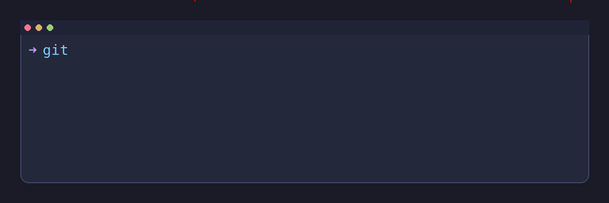

# Hey there, I'm **Satya Mani Sathkruth Damera** 👋

*Data Engineer · Builder of Data Pipelines · Microservices Tinkerer*

- **Working on**: Secure microservices + data engineering @ **Techwave** (Spring Boot, Angular, Docker, Eureka).
- **Previously**: Data Engineering & Analytics @ **Wipro**; BI for **First Abu Dhabi Bank**.
- **Learning**: RL for model selection, scalable AI/data pipelines, deeper cloud automation.
- **Ask me about**: ETL/ELT, Spark, Airflow, SQL tuning, JWT auth, microservices, and shipping stable infra.
- **Reach me**: [Email](mailto:damerasathkruth@gmail.com) · [LinkedIn](https://www.linkedin.com/in/damera-satya-mani-sathkruth-ba9083155/) · [GitHub](https://github.com/sathkruthdamera)

---

## 🚀 Tech Stack
`Python · SQL · Java · JavaScript · Spring Boot · Hibernate · Angular · Spark · Airflow · SSIS · Power BI · OBIEE · Oracle SQL · ODI · AWS · Docker · Eureka · REST APIs · JWT Auth · Microservices · Data Governance · HIPAA Compliance`

---

## 🔧 Professional Experience

**Techwave | Software Engineer Intern** *(Jun 2024 – Present)*  
- Built secure microservices for a quiz app (Spring Boot + Docker).  
- Implemented JWT-based authentication with RBAC.  
- Developed Angular UIs & optimized backend queries with JPA/Hibernate.  
- Deployed distributed services on Eureka.  

**Wipro Ltd. | Associate Consultant – Data Engineering & Analytics** *(Sep 2020 – Jan 2023)*  
- Automated ETL workflows (SSIS, ODI) with **99.9%** availability.  
- Optimized **100+** SQL/PL/SQL procedures → **30%** faster reporting.  
- Built Power BI & OBIEE dashboards for decisioning.  
- Ensured compliance for HIPAA & FATCA/CRS audits.  

**First Abu Dhabi Bank (via Wipro) | BI Consultant** *(Sep 2020 – Jan 2023)*  
- Designed real-time MIS dashboards and reports.  
- Partnered with financial stakeholders to deliver actionable insights.  

---

## 📚 Projects & Research
- **ISIC 2018 – Medical Imaging** → CNN (TensorFlow) with ~**85%** accuracy for lesion classification.  
- **Computational Linguistics & Phylogenetics** → Automated tree building in Python.  
- **Social Dynamics Modeling** → Simulated population trait propagation.  
- **Computer Vision & Image Processing** → Camera calibration + matrix transforms (OpenCV).  

---

## 🎮 Featured Repositories
> A few playful builds & experiments. More at the **Repositories** tab.

| Repository | What it is |
|---|---|
| **[TAILS-OS-SIMULATOR](https://github.com/sathkruthdamera/TAILS-OS-SIMULATOR)** | A TypeScript mini‑OS sim with terminal vibes. |
| **[The-Gourment-Place](https://github.com/sathkruthdamera/The-Gourment-Place)** | A simple restaurant/place app—TypeScript front to back. |
| **[STOCK-PICKER](https://github.com/sathkruthdamera/STOCK-PICKER)** | Tiny utility experimenting with ticker picking logic. |
| **[SPASHOLZ](https://github.com/sathkruthdamera/SPASHOLZ)** | Space‑themed TypeScript project because the universe deserves code. |
| **[DUMB-OS](https://github.com/sathkruthdamera/DUMB-OS)** | A “throwaway” OS project that’s sneakily educational. |
| **[QTICKETING](https://github.com/sathkruthdamera/QTICKETING)** | A ticketing concept app (HTX Metro vibes). |
| **[GUI-EMULATOR](https://github.com/sathkruthdamera/GUI-EMULATOR)** | Emulates app/workspace layouts for training & experiments. |

---

## 🎓 Education & Certifications
- **M.S., Computer Science** - Wichita State University  
- Oracle Cloud Platform Application Integration Specialist  
- AI Foundations (Udacity) · Cloud Computing (NPTEL)

---

## 🌱 One-liner
> “Data doesn’t lie but sometimes it just trolls you. Double‑check.”

---

