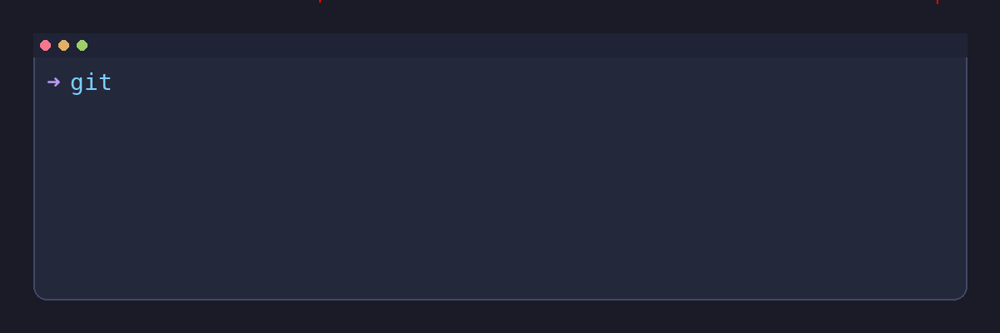

<h1 align="center">Hi, I'm Satya Mani Sathkruth Damera 👋</h1>

  <b>Data Engineer · Systems Builder · AI & Edge-Sensing Tinkerer</b> 
  Designing data pipelines, ETL/ELT workflows, and analytics in healthcare & finance — 
  and shipping side projects across AI tooling, computer vision, edge hardware, and mobile.

  
  

---

## These are my recent adventures lately

A focused sprint from **Feb → Jun 2026** — shipping across AI tooling, research, edge hardware, and mobile.

### ⚡ [Tarrif_Shock-EWS](https://github.com/sathkruthdamera/Tarrif_Shock-EWS) · `Python` · `LLM` · `Time-Series ML` · `Causal Inference`
**Tariff & Geopolitical Shock Early-Warning System (EWS)**
An early-warning system for tariff- and geopolitics-driven shocks in commodity and supply-chain time series. It combines three current techniques into one pipeline:

- **Zero-shot foundation-model forecasting** with calibrated prediction intervals.
- **Event-informed reasoning** over tariff / policy announcements.
- **Causal break attribution** that names the most likely driver of a move, with a verifiable source link.

**v1 vertical:** steel / steel-exposed sectors (HRC futures, SLX ETF proxy). **v2 vertical:** Moirai-2 with macro covariates; LLM explanation layer; additional verticals (oil, semiconductors, ag); streaming alerts to Slack/Teams.

### 🐜 [AITERMITE](https://github.com/sathkruthdamera/AITERMITE) · `Python` · `CLI` · `LLM Integration` · `Shell Automation` · *on PyPI*
An **AI terminal copilot** for Windows, macOS, and Linux that fixes failed commands and answers plain-English questions right at your prompt.
- **Ask mode** — type a thought with no prefix; it routes to Claude / Codex / local Ollama and offers an arrow-key menu to run suggested commands.
- Auto-detects signed-in CLI agents (no API keys needed), redacts secrets before any provider call, and blocks dangerous commands (`rm -rf /` & friends).
- Works across PowerShell, zsh, bash, fish, and cmd.exe (via Clink hooks). `pip install aitermite`
- Published and versioned on PyPI (v0.5.0 "Ask Mode") with shell hooks for automatic post-failure suggestions and pre-Enter typo detection.

### 🛰️ [Bonds-eye](https://github.com/sathkruthdamera/Bonds-eye) · `Python` · `ESP32-S3` · `React Native` · `FastAPI` · `Docker` · `WebSocket` · `Signal Processing`
A **WiFi-sensing presence & motion system** built on a distributed mesh of ESP32-S3 nodes.
- Streams **live presence, motion intensity, signal disturbance, node health, RSSI/CSI variance, event alerts, and a confidence score**.
- FastAPI + Docker Compose + Nginx backend with WebSocket live streaming; React Native / Expo companion app.
- Honest by design — practical telemetry over unverifiable vital-sign claims.
- Three wireless sensor nodes bridge over a mobile hotspot to cloud infrastructure via UDP/TCP, with an optional local gateway for low-latency edge processing.

### 🗺️ [ELEX](https://github.com/sathkruthdamera/Improving-2D-Navigation-Clarity-at-Multi-Level-Interchanges-with-ELEX) · `Python` · `NumPy` · `Matplotlib` · `Data Visualization` · *Research*
**Elevation-Aware Exploded Layout** — making tangled multi-level highway interchanges (think Dallas–Fort Worth stacks) readable on flat 2D nav displays.
- Luminance-coded bridge height, route halos/casings, dimmed inactive roads, and **localized exploded views** that activate only at high-complexity zones.
- Simulation in NumPy + Matplotlib scoring complexity by bridge/overlap density, elevation variance, and structure — with lookahead activation and benchmark figures.
- Benchmarks five rendering approaches, from baseline 2D mapping to the full multi-channel ELEX treatment, with vectorized metric computation.
- Outputs comparison figures and step-by-step pipeline diagrams; proposes future human-subjects testing on exit accuracy, decision time, route fidelity, and cognitive workload.

### 📱 [Polli-nation iOS App](https://github.com/sathkruthdamera/Polli-nation-IOS-APP) · `Swift` · `SwiftUI` · `iOS Development`
A native **SwiftUI iOS app** exploring a pollinator/environment theme.
- Built fully native in Swift / SwiftUI with a declarative, component-driven UI.
- Focuses on clean navigation and a smooth, responsive user experience.
- Structured for maintainability with reusable views and clear state management.
- A hands-on dive into the Apple ecosystem and modern iOS development patterns.

### 🤖 [mukkuloavis_bot](https://github.com/sathkruthdamera/mukkuloavis_bot) · `JavaScript` · `Bot Automation` · `Event-Driven Architecture`
A JavaScript bot project — automation and chat experiments.
- Event-driven JavaScript automation handling commands and user interactions.
- Modular command structure that's easy to extend with new behaviors.
- Experiments with conversational flows and scripted responses.
- A playground for rapid prototyping of bot ideas and integrations.

---

## 🧰 Tech Stack

**Languages** &nbsp;

**Data & Cloud** &nbsp;

**Frameworks** &nbsp;

---

## 💼 Experience

### Data Engineer — SyscoFoods *(May 2024 – Present)*
- Design and maintain production ETL/ELT pipelines that ingest and transform high-volume supply-chain and operational data into the analytics platform.
- Build and tune Apache Spark jobs and orchestrate workflows with Airflow, improving reliability and reducing end-to-end processing times.
- Partner with analytics and business teams to model curated, query-ready datasets and add data-quality and observability checks across pipelines.

### Data Engineering & Analytics BI Consultant — First Abu Dhabi Bank *(Jun 2019 – Jan 2023)*
- Delivered BI and analytics solutions for banking and financial reporting, translating business requirements into robust data models and dashboards.
- Engineered ETL workflows and optimized complex SQL to consolidate data from multiple source systems into a trusted reporting layer.
- Partnered with stakeholders to define KPIs and self-service reporting, improving data accuracy and turnaround on decision-critical insights.

### Graduate Data Engineering Intern — Wichita State University *(Jan 2023 – May 2024)*
- Supported research and academic data projects, building pipelines to collect, clean, and structure datasets for downstream analysis.
- Developed Python- and SQL-based tooling to automate repetitive data-prep and reporting tasks.
- Collaborated with faculty and student teams, applying data-engineering best practices while completing graduate coursework.

Building data pipelines, ETL/ELT workflows, Spark jobs, and microservices across healthcare and financial domains.

---

## Skill Spread

  

---

<i>"Data doesn't lie — but sometimes it just trolls you. Double-check."</i>

  📫 <a href="mailto:damerasathkruth@gmail.com">damerasathkruth@gmail.com</a>

